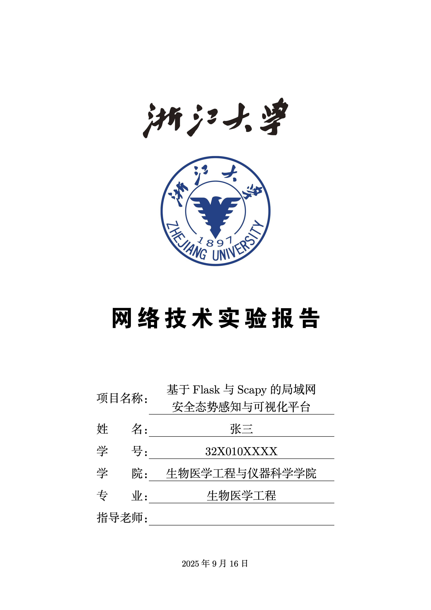
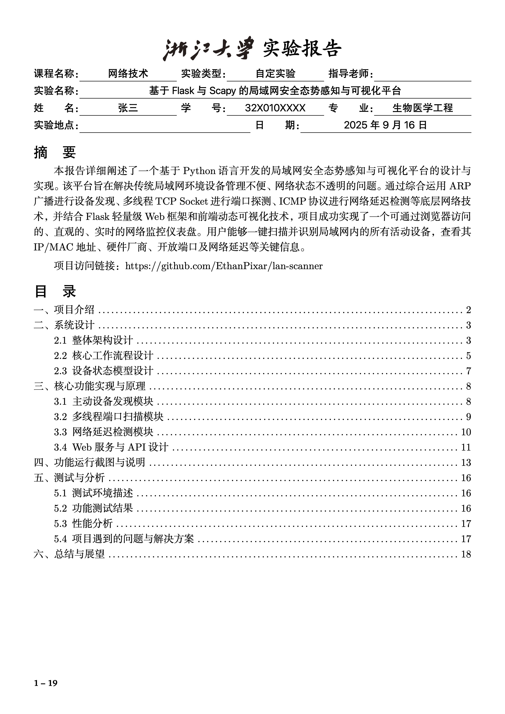
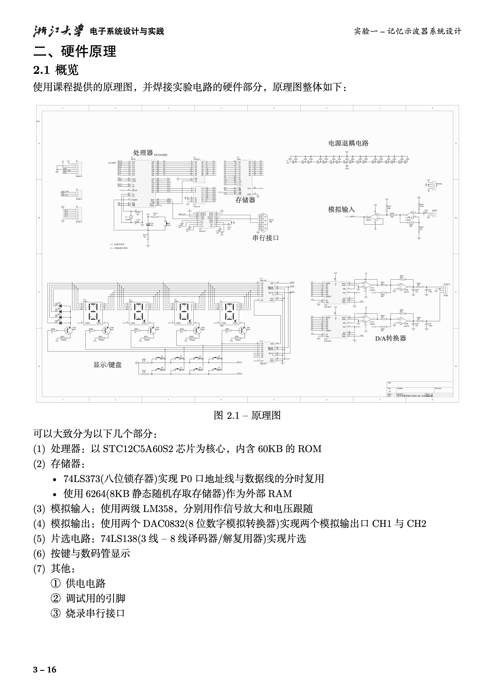
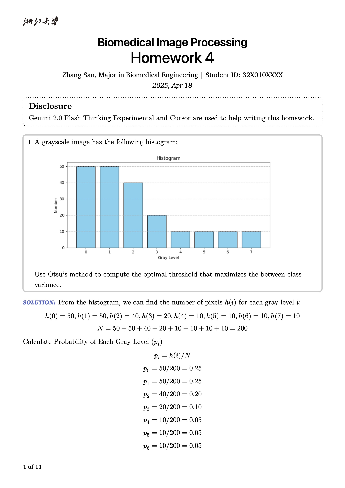
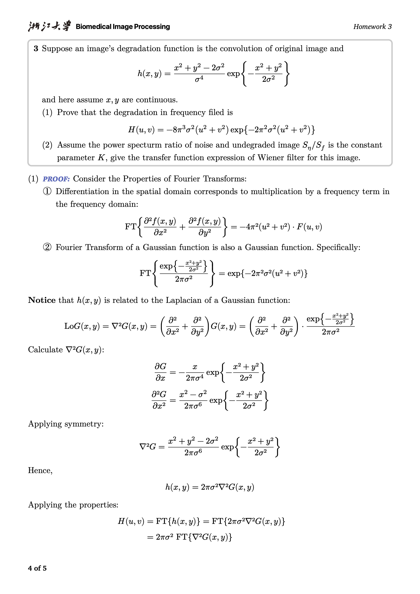
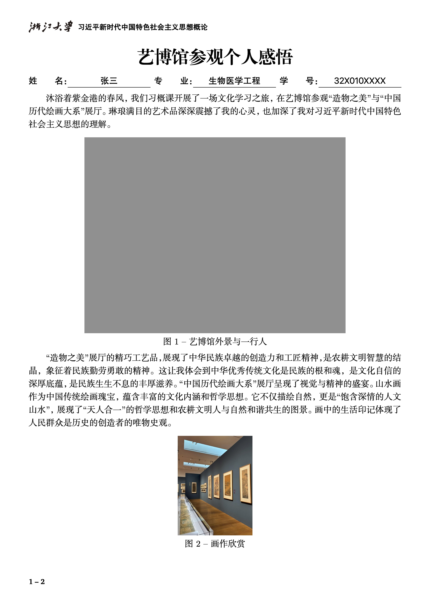

# ZJU Typst 模版

Typst 模版，适用于浙江大学各类文档、作业、报告等场景。

## 关于 Typst

如果你已经是 Typst 资深用户，可跳转至[关于本模版](#关于本模版)。

### 什么是 Typst

Typst 是一款现代化的排版语言，类似 LaTeX，但各方面都更好用，并且性能极佳。

与LaTeX相比，Typst 具有以下优势：

1. 数学公式部分非常简洁，可以对比以下的例子：
    $$
    \text{Prewitt}(+45\degree) = \begin{bmatrix}
      -1 & -1 & 0 \\
      -1 & 0 & 1 \\
      0 & 1 & 1
    \end{bmatrix}
    $$
    LaTeX:

    ```latex
    \text{Prewitt}(+45\degree) = \begin{bmatrix}
      -1 & -1 & 0 \\
      -1 & 0 & 1 \\
      0 & 1 & 1
    \end{bmatrix}
    ```

    Typst:

    ```typst
    "Prewitt"(+45 degree) &= mat(
      -1, -1,  0;
      -1,  0,  1;
      0,  1,  1
    )
    ```

2. 语法现代，清晰易懂。Typst 采用函数式结构，所有模块都可以轻松复用，并且可以很方便地参数传递。

3. 性能极佳。Typst 使用 Rust 语言编写，编译速度非常快，且内存占用低，预览毫无延迟。

4. 使用方便，文件清爽。可以通过 VS Code 插件直接使用；Typst 使用单一文件进行编写，便于管理。

与 Word 等传统排版工具相比，Typst 具有以下优势：

1. 一切规则由你决定，不存在 Word 中不知所云的设置项，和莫名其妙的排版大乱。
2. 一切格式都是确定的，相同的层级、图片、题注等等永远是相同的格式，和「格式刷」说拜拜。
3. 一切都是代码和源文件，图片代码都从源文件插入，不需要手动更新，可通过 **GitHub 协作**。
4. 由于在 VS Code 中进行编辑，可以使用**代码补全、VS Code 编辑器特性、Git 管理**等。

### 如何入门 Typst

- [官方文档](https://typst.app/docs/)
    简单入门和对所有函数的介绍
- [Typst 非官方中文交流群](https://qm.qq.com/q/q9fNy4PouQ)
    遇到难点和想实现的功能可以在群里提问
- [Typst Universe](https://typst.app/universe/)
    这是一个 Typst 模版和资源的集合网站，可以在这里找到很多有用的模版和功能

## 关于本模版

本模版库是作者在大三期间为提高写报告和作业的效率而不断优化的，现已稳定。

**模版特点：**

1. 风格简洁现代，同时字体大小、行距、页边距等均经过精心设计，适合打印以及电子版阅读。
2. 支持中英文双语，且可以轻松切换。
3. 内含大量模块，如代码块、三线表、题目块、声明块，使用方便。

本模版库中包括以下几个模版：

- Homework：作业模版
- Report：报告模版
- Article：文章模版
- Note：笔记模版

**模版预览**

| Report 封面                      | Report 目录                    | Report 正文            |
| ------------------------------- | ----------------------------- | ---------------------- |
|  |  |  |

| 作业模版 | 作业模版 | 短文模版 |
| ---------------------------- | --- | ----------------------------- |
|  | |   |

## 使用方法

1. 使用 VS Code 打开仓库
2. VS Code 中安装 Tinymist Typst 插件
3. 把 `info-example.json` 文件中的信息为你自己的相关信息，并重命名为 `info.json`。
4. 在文件 `zju-typst-tplt/0.2.0/template/support/list/fonts.typ`，可以看到字体列表：

    ```typst
    #let ensans = "SF Pro Display" // 英文无衬线体
    ...
    #let mono = ("SF Mono", "PingFang SC")// 等宽字体
    ```

    为保证显示效果相同，需安装以下字体包`fontsForTypst.zip`（或者修改为你系统中已有的其他字体）。

    [字体包下载链接（使用浙大云盘）](https://pan.zju.edu.cn/share/cf92632a20a38535870a92f2e0)

5. 把 `zju-typst-tplt` 放在 Typst 指定的本地模版目录下，该目录需通过 VS Code 命令面板 `Cmd + Shift + P` 输入 `Typst: Create Local Packages` 在这个目录下先创建一个模版文件夹，打开这个文件夹的位置，再把 `zju-typst-tplt` 拷贝到这个名为 `local` 的文件夹中（原来创建的模版文件夹也就没用了，之后可以通过 `Typst: Open Local Packages` 来打开这个模版）。

    ps：这个路径在 macOS 下的地址为 `/Users/ethanpixar/Library/Application Support/typst/packages/local/`。

    另注：我为了在日后使用时方便，并没有使用 `zju-typst-tplt` 作为模版文件夹名，而是将其缩减为了 `tplt`，故在使用模版时的导入为 `@local/tplt:0.2.0`；如果你不希望改模版名字，可以把 `@local/tplt:0.2.0` 改为 `@local/zju-typst-tplt:0.2.0`，并修改 `zju-typst-tplt/0.2.0/typst.toml` 中的 `name` 字段为 `"zju-typst-tplt"`。

完成以上步骤后，在任意目录下新建 `xxx.typ`，都可以使用该模板，在 `xxx.typ` 文件开头输入：

```typst
#import "@local/tplt:0.2.0": * // 或者 @local/zju-typst-tplt:0.2.0 视你上一步命名而定

#show: BL // 基本样式，务必首先使用
// 定义文件信息
#let ymd = "2025-04-8" // 日期，格式为 YYYY-MM-DD
#let course = "Biomedical Image Processing" // 课程名称
#let proj-name = "Homework 3" // 作业/项目名称

// 具体模版，可以选择 HW(Homework), NT(Note), RP(Report), AR(Article)
#show: HW.with( 
    proj-name: proj-name,
    course: course,
    english: true,
    ymd: ymd,
)

... // 正文内容
```

- 使用快捷键 `Cmd + K, V` 进行预览。
- 代码编辑器最上方的 `Export PDF` 可以导出 PDF。

- 使用命令面板 `Cmd + Shift + P`，输入 `Typst` 查看更多指令。

## 使用示例

参见 `examples/` 目录下的示例

## 常用模块

1. 使用

    ```typst
    #codex(read("code/xxx.py"), lang: "python")
    ```

    来插入代码块

2. 使用

    ```typst
    #figure(image("pic/xxx.png/jpeg/svg", width: ?%), caption: [图片标题])
    ```

    来插入图片
